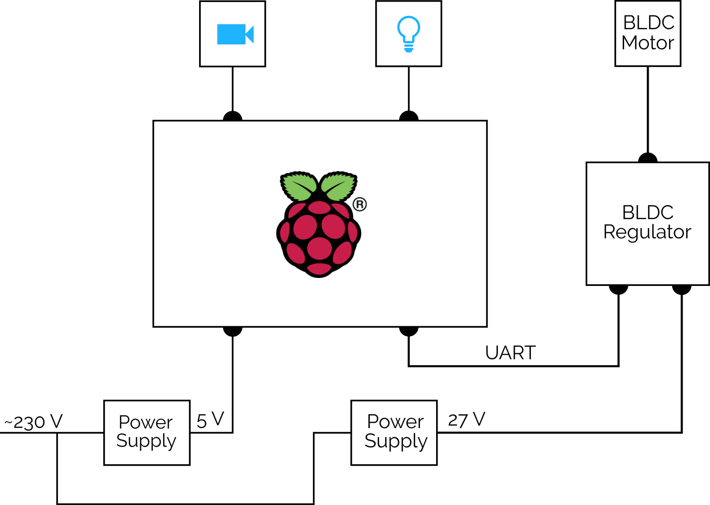

# Double Hoop and Ball
Hoop and ball model is, as the name suggests, a model consisting of a ball and hoop. The ball can freely rotate in the hoop and the hoop is attached to a motor which allows us to exert a torque on the hoop. This model is used for demonstration and teaching of linear control theory where the goal is to damp the undesired oscillations of the ball. In other words, the goal is to calculate a torque acting against the oscillations based on the measured position of the ball.

Our improved version of *Ball and Hoop* model is shown in the figure below. In addition to the classical task of damping oscillatins, it also allows some more challenging taks like, for instance, *Loop The Loop* task. For more details see our paper describing two such tasks in detail [1].

# Description of The Model
A schematic description of the hardware setup of the model is shown in the figure bellow.

The brain of the whole hardware setup is *Raspberry Pi 3* which has enough computational power to run a control algorithm and also to measure position of the ball by processing of images from a camera. Raspberry Pi is powered by 5 V which are obtained by a power supply converting alternating 230 V to direct 5 V. It also communicates with a custom-made BLDC regulator via UART and switches off and on a LED lamp illuminating the ball with the hoop. The BLDC regulator allows the control system running on Raspberry Pi to command torque acting on the hoop.

## Camera
We used a Raspberry Pi Camera module v1. We chose this particular camera because it is cheap, it has high frame rate (up to 90 fps for VGA resolution) and in comparison to the newer Camera Module v2 it doesn't crop the images for VGA resolution to quarter of the image sensor size.

## BLDC regulator
We developed our own BLDC regulator which allows us to command torque acting on the hoop. The regulator is based on a regulator designed by Ben Katz during his bachelor's project at MIT titled "Low Cost, High Performance Actuators for Dynamic Robots". Details can be found at his blog http://build-its-inprogress.blogspot.cz. The code of the regulator was developed at mbed.org and is freely available at *https://developer.mbed.org/users/MartinGurtner/code/Flying-Ball_BLDC_Ctrl/. The scheme and board design can be found in *bldc_controller*.

## BLDC motor
We used BLDC motor GBM6208-150T because it is a motor meant for gimbals and has mounting halls for a magnetic rotation sensor.

## Power Supplies
We needed two power supplies, one 5 V power supply for Raspberry Pi 3 and one approximately 30 V power supply for the BLDC regulator and motor. We bought both of them on ebay where one can get some really cheap (several bucks at max) power supplies converting AC 230 V to various fixed DC voltages. 

## Hoop
The hoop consists of three parts which are 3D printed by Ultimaker 2+. The parts are glued screwed together. Along inserted rubber o-rings along the circumference where the ball is in contact with the hoop in order to increase friction and thus prevent slippage of the ball. CAD files of the hoop can be found in *cad/hoop/*.

## Ball
We use metal balls of size ranging from 20 mm to 24 mm in diameter. In order to facilitate identification of the balls in the images, all balls are painted to a red color.

## Lamp
We bought a LED EMOS klasik 12W, which is a LED light bulb, dismantled it and mounted the board with the LEDs to a custom-made heatsink (the CAD files of the heatsink can be found in *cad/lampHeatSink/*). The lamp can be switched off and on by a relay controlled by the Raspberry Pi.

# References
[1] M. Gurtner and J. Zemanek, "Ball in double hoop: demonstration model for numerical optimal control". *To appear*. 