<!--
# Ball in Hoop

## Introduction -->

The assembly guide is divided into several steps. At first, we will make the light, then we will make the box. Then we will attach it to the acrylics. Successively, we print the motor holder and the hoop in 3D printer, mount the holder to the board, attach the motor, encoder and ODrive to the holder and finally mount the hoop to the motor. Then we will wire all things together and move to the software.

# 1. Light

Please visit <https://github.com/aa4cc/raspicam-lamp>

We actually realized that we are not satisfied with the concept of the light (see _Future development_) and decided to solder several things differently from what we previously intended. Details are provided in the next picture:

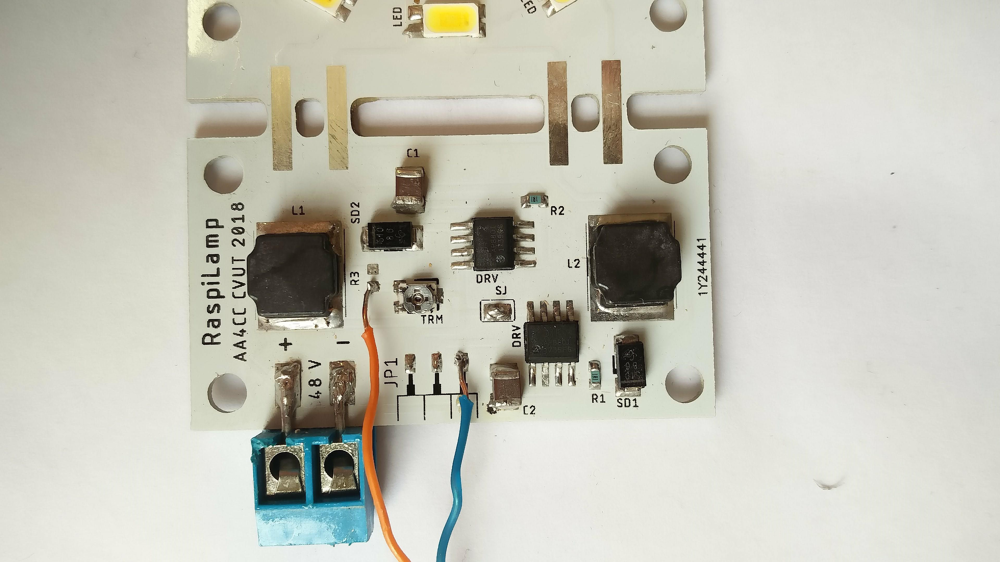

This means that we used the trimmer to lessen the voltage coming from RPi (3.3V) to a voltage convenient for the AP8801 chip (cca 1.25V) and we control both LED branches simultaneously, because solder jumper is soldered.

# 2. Box

Box is glued together according to following pictures:

Inner walls in the box are not glued in order to be easily removed in case of need. You can put the inner walls into the box thanks to enlarged holes in the back and the right side of the box:

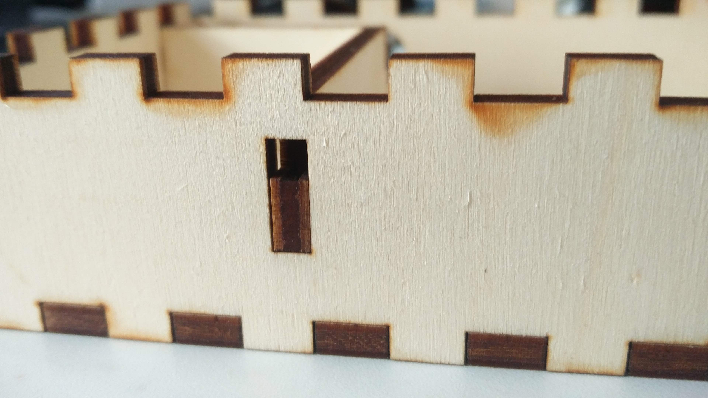

# 3. Acrylic

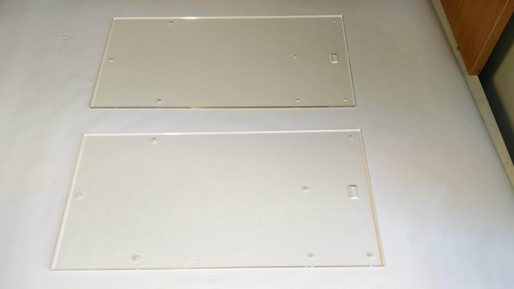

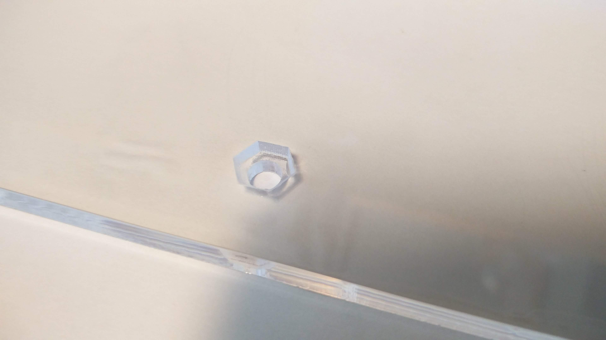

We put the not-engraved acrylic on the engraved one, place the box on the top and mount everything together with screws.

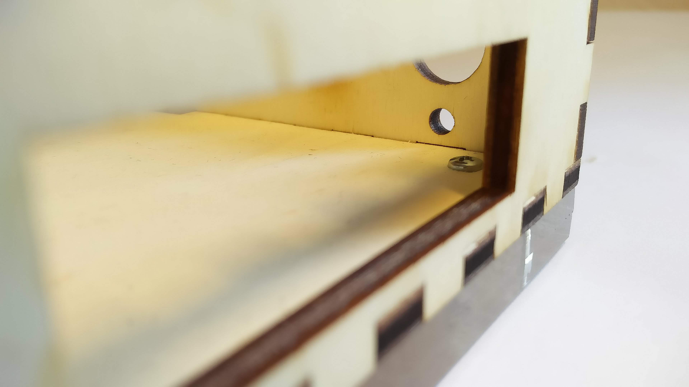

# 4. Motor holder

(tady bude timelapse)

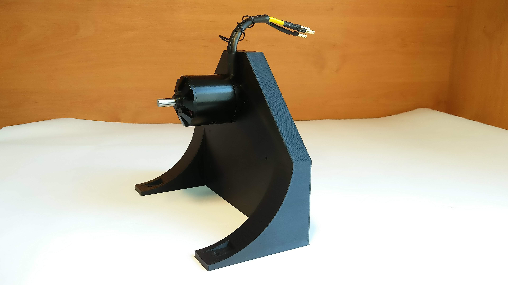

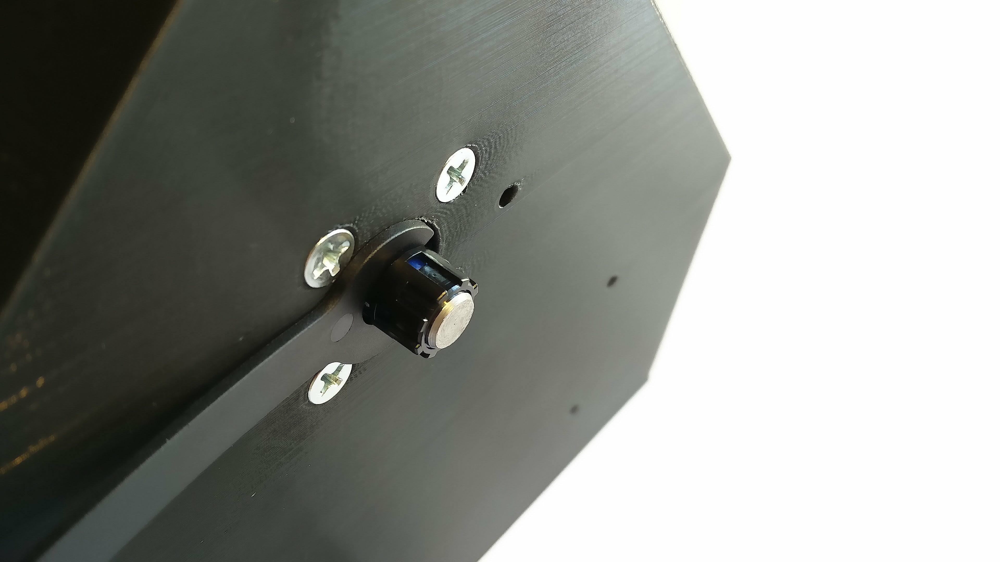

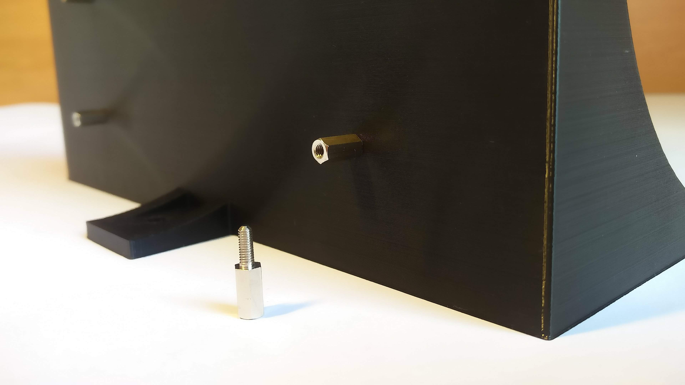

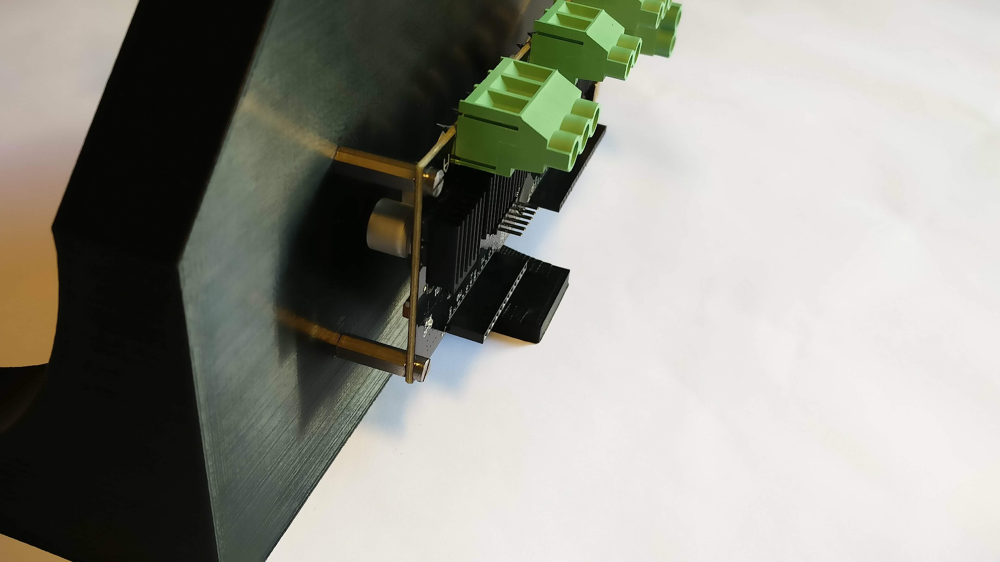

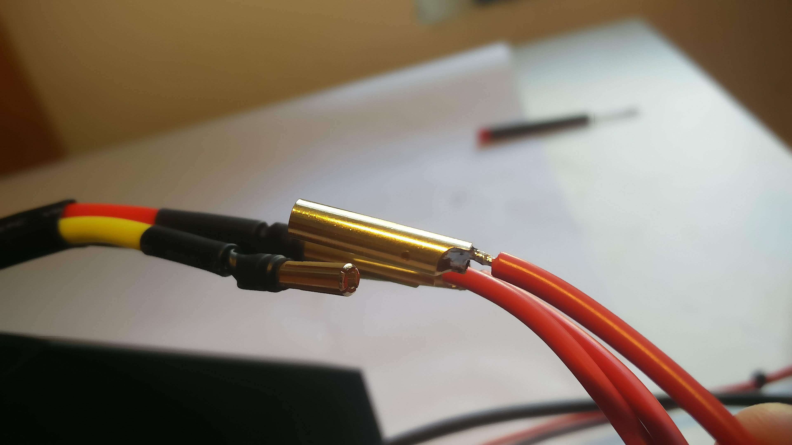

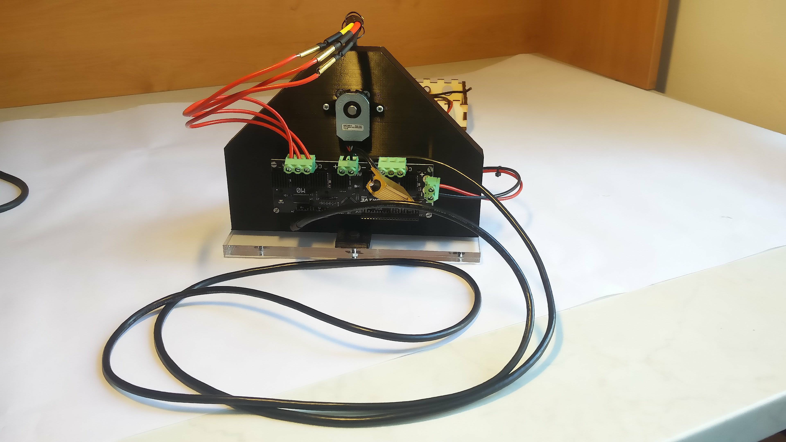

After that, we attach the holder to the acrylic.

# 5. Hoop

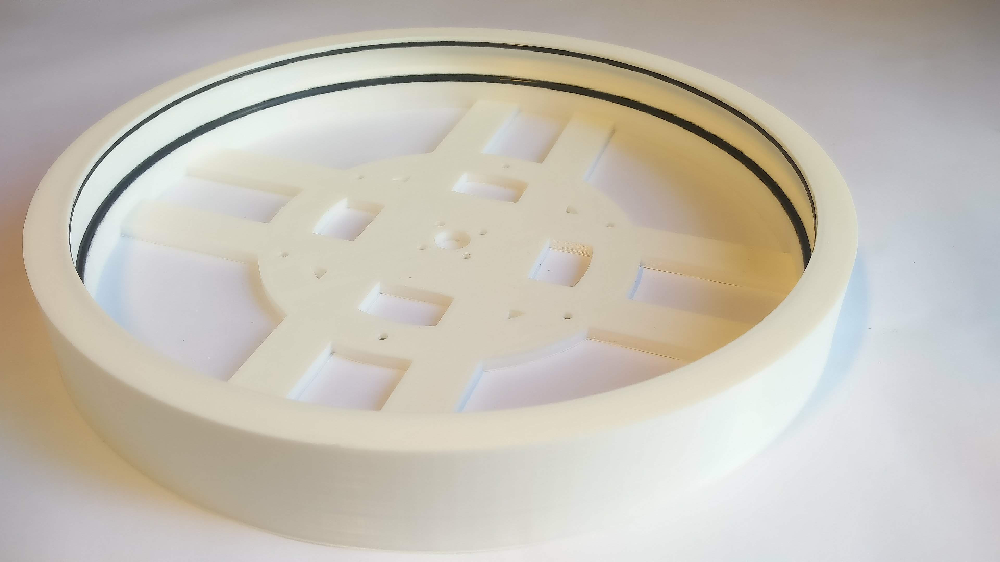

The o-rings must be thoroughly pressed into the hoop otherwise they will cause bouncing of the ball. We recommend to use screw washers while mounting the hoop to the motor.

# 6. Electronics and wiring

We mount the RasPi into the box using plywood spacers (we had screws that were too long, so we gave the spacer also above the RasPi).

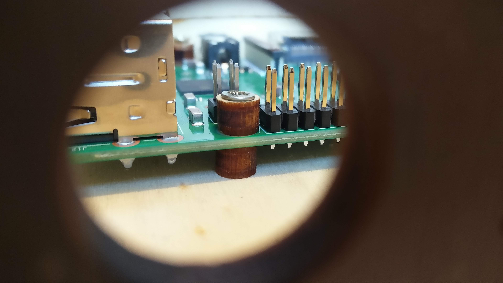

We put the connectors into the front side of the box, solder the wires to them and cover the connections with a heat shrink tubing. We use Wago Lever Nuts when need to branch the wires.

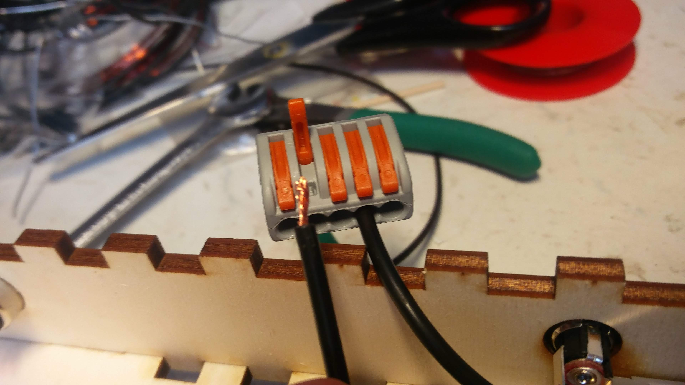

(Wiring picture to be added)

# Future development

1. To lessen the RasPi PWM signal from 3.3V to 1.25V directly on the light module.

2. To make the camera mounting holes tighter and to cut a screw thread in them so that no nuts were needed.

3. To redesign the power and PWM connectors on the light module in a smarter way.

4. To use a motor with a shorter shaft which would not overhang into the hoop.
